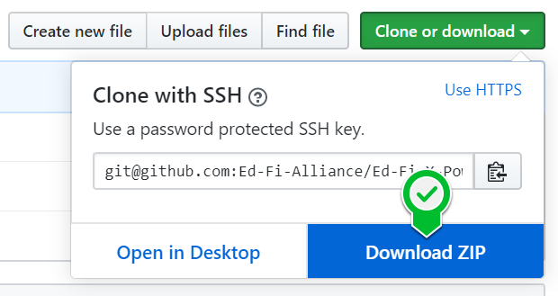
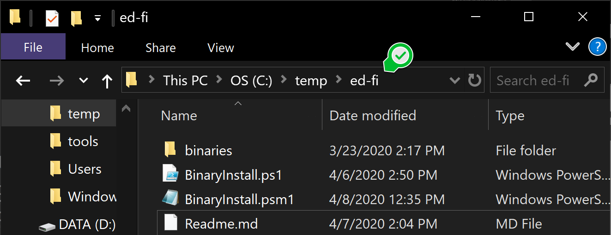
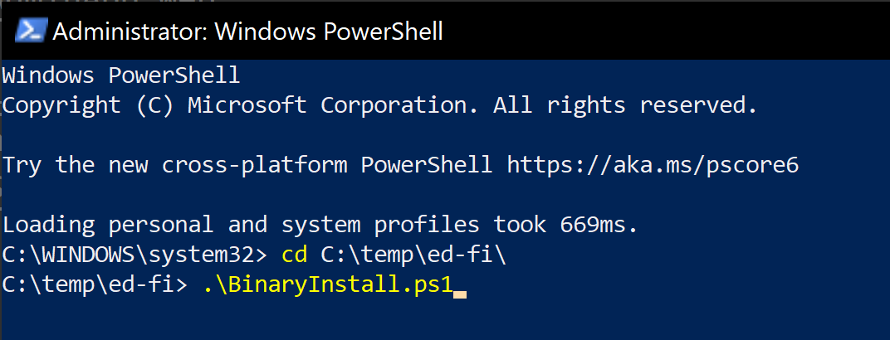

PowerShell Ed-Fi MyGet Installer Scripts
============

These scripts were made possible thanks to the Michael and Susan Dell Foundation.

Description
------------
These PowershellScripts install the public Ed-Fi binaries published on the MyGet feed.
Bianries can be found here:
* Ed-Fi ODS\API: https://www.myget.org/feed/ed-fi/package/nuget/EdFi.Ods.WebApi.EFA
* AdminApp: https://www.myget.org/feed/ed-fi/package/nuget/EdFi.ODS.AdminApp.Web
* Sandbox Admin: https://www.myget.org/feed/ed-fi/package/nuget/EdFi.Ods.Admin.Web.EFA 
* Docs-Swagger: https://www.myget.org/F/ed-fi/api/v2/package/EdFi.Ods.SwaggerUI.EFA

Prerequisites
------------
We recommend that the following prerequisites are installed on the machine that you are going to run the scripts on.

1. MsSQL Server 2017 or higher. (If using for development you can use the Developer edition. If this will be a production environment please use appropriate licensing. These scripts were tested with 2016 and 2019 versions.)
2. IIS - Internet Information Services (The Windows Web Server. Even though the scripts run a check on prerequisites and installs it if its not there we have seen weird issues where its better to have it preinstalled.)
3. .Net Framework 4.8. (The scripts will install it but you will have to restart the machine. This is why we recommend to be installed before hand.)

That is it =)


Setup Instructions
------------

1. Download the scripts in zip format 
<br/>
2. Unzip them to a known location like C:\temp\ed-fi\

3. Open PowerShell as an "Administrator"
<br/>
4. Navigate to the path where you unziped the scripts
<br/>
5. Execute the following commands:

```PowerShell
C:\temp\ed-fi\> .\BinaryInstall.ps1
```
<br/>
<br/>Then choose the environment you wish to install and install it. For the sake of this tutorial we will do "Production"

```PowerShell
C:\temp\ed-fi\> Install-EdFiProduction
```
You will see a screen like the one bellow: "Confirms Done"
<br/>

## License

Licensed under the [Ed-Fi
License](https://www.ed-fi.org/getting-started/license-ed-fi-technology/).