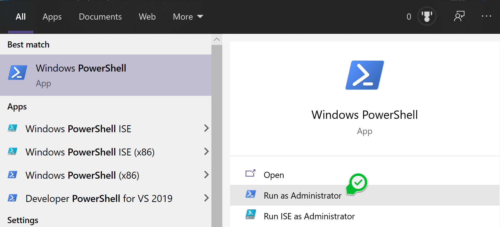
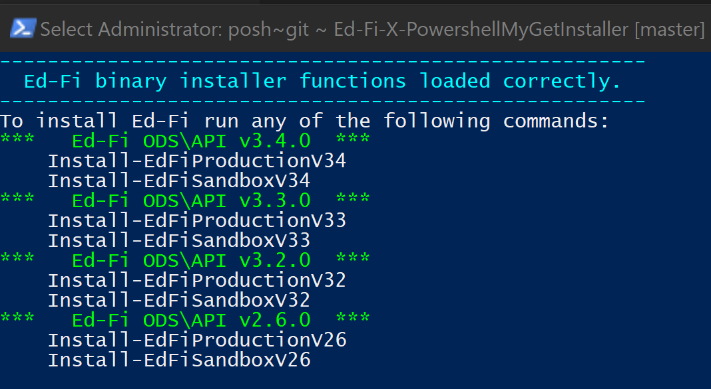
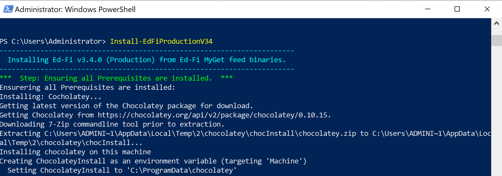
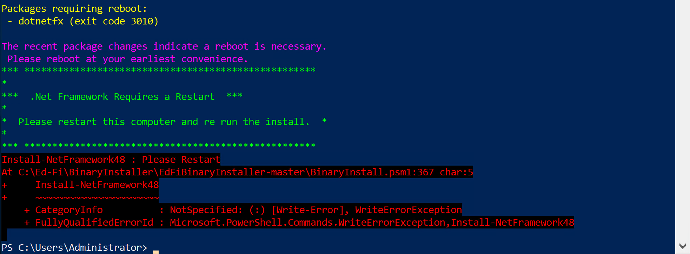
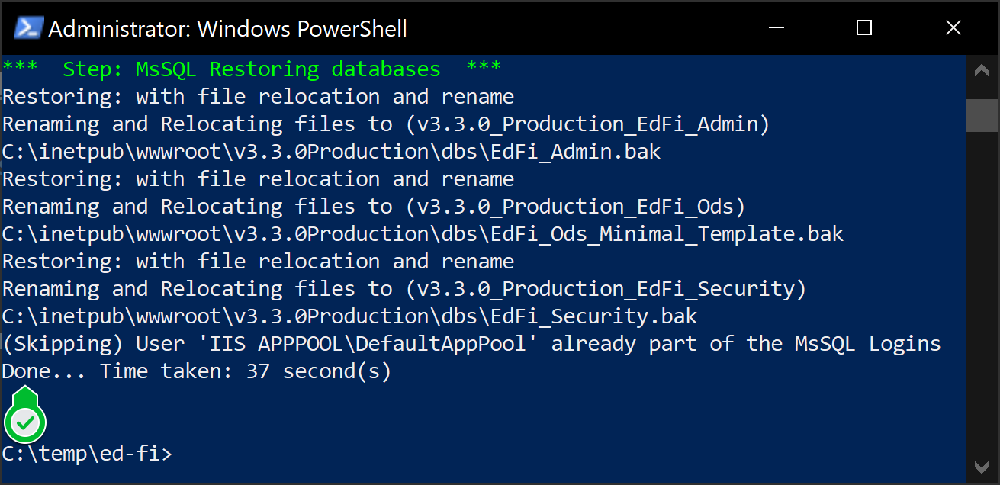

# PowerShell Ed-Fi MyGet Installer Scripts

These scripts were made possible thanks to the Michael and Susan Dell Foundation.

## Description

These Powershell scripts install the public Ed-Fi binaries published on the MyGet feed.

**Note:** As of the latest update these scripts can install the ODS API, Docs,  AdminApp & SandboxAdmin in the following versions:
* v3.4.0
* v3.3.0
* v3.2.0
* v2.6.0

Bianries can be found here:
* Ed-Fi ODS\API: https://www.myget.org/feed/ed-fi/package/nuget/EdFi.Ods.WebApi.EFA
* AdminApp: https://www.myget.org/feed/ed-fi/package/nuget/EdFi.ODS.AdminApp.Web
* Sandbox Admin: https://www.myget.org/feed/ed-fi/package/nuget/EdFi.Ods.Admin.Web.EFA 
* Docs-Swagger: https://www.myget.org/F/ed-fi/api/v2/package/EdFi.Ods.SwaggerUI.EFA

## Prerequisites
### Minimum System Requirements
A machine or virtual machine with internet access.

* 50GB free storage space
* 4GB+ of available RAM
* Windows Server 2019
* Administrator access to physical machine or virtual machine

### Software Requirements

**NOTE:** If you do not have these prerequisites the scripts will install them for you. This will require a restart.

* MsSQL Server 2019 or higher
* IIS - Internet Information Services
* .Net Framework 4.8. (Restart will be required if not previously installed.)

That is it =)


## Setup Instructions

**1)** Open a Windows PowerShell as and Administrator.
From the **Windows Menu**, search for **PowerShell**, right click on it, and select **Run as Administrator**
<br/>

**2)** Run the automated installer by pasting this command in to the PowerShell window:
> Set-ExecutionPolicy Bypass -Scope Process -Force; [System.Net.ServicePointManager]::SecurityProtocol = [System.Net.ServicePointManager]::SecurityProtocol -bor 3072; Invoke-Expression ((New-Object System.Net.WebClient).DownloadString('https://github.com/Ed-Fi-Exchange-OSS/Ed-Fi-BinariesPowerShellInstaller/raw/main/install.ps1'))

It will download all necessarry scripts and display an install menu like the image below:
<br/>

**3)** Run the Ed-Fi v3.4.0 installer by pasting this command in to the PowerShell window:

```PowerShell
Install-EdFiProductionV34
```
You will see the script executing. It will check  for prerequisites and install as needed. (Sample image below)
<br/>

This part of the installer will take about 10-30 mins to download and install the components of this solution.

***NOTE:** If you dont have .Net Framework 4.8 it will install it for you, however it will require a restart.

***After the restart redo step 1, 2 & 3.**
<br/>


**4)** Once the Ed-Fi install finishes you will see a screen like the one bellow: "Confirms Done"
<br/>

## Legal Information

Copyright (c) 2020 Ed-Fi Alliance, LLC and contributors.

Licensed under the [Apache License, Version 2.0](LICENSE) (the "License").

Unless required by applicable law or agreed to in writing, software
distributed under the License is distributed on an "AS IS" BASIS,
WITHOUT WARRANTIES OR CONDITIONS OF ANY KIND, either express or implied.
See the License for the specific language governing permissions and
limitations under the License.